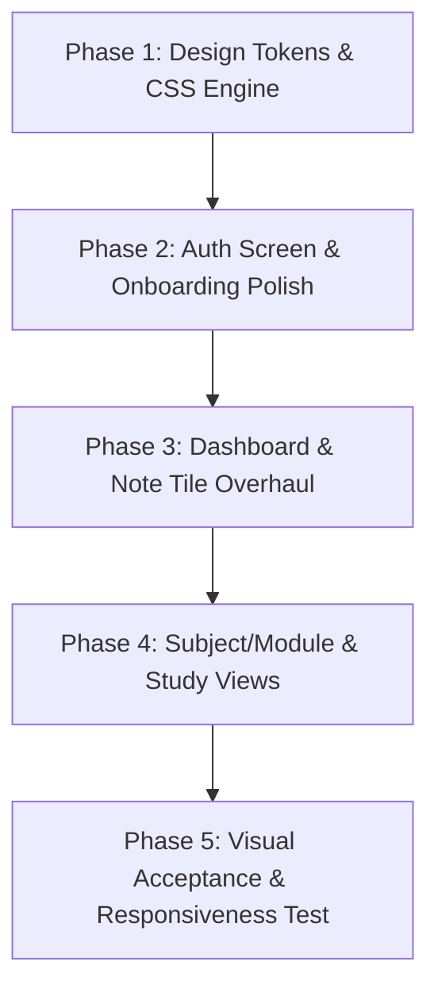

# LUCY — Visual & UX Elevation Plan (5/10 → 8.5/10)

**Document:** `AG_update.md`  
**Date:** 11 September 2026  
**Status:** Approved for Implementation  
**Governing Documents:** `MASTER.md`, `docs/PRODUCT_SPEC.md`, `docs/LUCY_STYLE_GUIDE.md`, `AGENTS.md`

---

## 1. Executive Summary & Assessment

An evaluation of the current development deployment (`https://lucy-dev.1zero9.com/`) establishes a baseline score of **5/10**:
* **The Good:** Clean typography, reliable server-side rendering, solid underlying routing, and adherence to privacy/user isolation rules.
* **The Gap:** The visual execution suffers from "boilerplate SaaS template syndrome"—flat cardboard surfaces, isolated floating white boxes, zero micro-interactions (e.g. no password show/hide, no input hover states), and an overly utilitarian first impression that fails to communicate the value of *"Your college brain"*.

### Objective
Elevate the entire product experience to a **solid 8.5+/10** (matching the visual craft, tactile depth, and fluid ergonomics of top-tier tools like Linear, Craft, and Apple Notes) while strictly adhering to LUCY’s core principles: **Obvious beats clever, Fast capture, and Quiet safety**.

---

## 2. Gap Analysis (Why the Current State is 5/10)

| Dimension | Current State (5/10) | Target State (8.5/10) |
|---|---|---|
| **First Impression (Auth)** | Isolated white box on a basic dot grid; looks like an uncustomized starter kit. | Branded, high-trust gateway with product feature badges, tactile card depth, and polished entry animation. |
| **Surface Tactility** | Flat 1px borders (`#E2E8F0`) and solid flat purple buttons with zero depth. | Layered ambient shadows, subtle top-edge inner light catch (`inset 0 1px 0 rgba(255,255,255,0.2)`), and rich micro-gradients. |
| **Form Usability** | No password visibility toggle, no autofocus on desktop, static inputs with no hover feedback. | Leading input iconography, interactive show/hide password toggle, autofocus, and smooth focus ring glow. |
| **Dashboard & Workspace** | Note tiles feel flat and text-heavy; stickies look like generic text boxes; search bar is static. | Module-tinted vertical accent bars on note cards, tactile pastel stickies with paper depth, and `⌘K` command shortcut badge on search. |
| **Motion & Micro-feedback** | Instant hard swaps between states; no entrance physics. | Subtle 180–220ms spring entrance transitions, tactile button press scaling (`scale(0.98)`), and smooth error banner fades. |

---

## 3. The 5-Pillar Elevation Blueprint

```
       CURRENT (5/10)                                UPGRADED (8.5/10)
┌───────────────────────────┐            ┌──────────────────────────────────────────────┐
│        [App Icon]         │            │  ✦ LUCY                 "Your college brain" │
│     Sign in to LUCY       │            ├──────────────────────┬───────────────────────┤
│  [ Email               ]  │    ───►    │  Welcome back        │  ⚡ Fast Capture       │
│  [ Password            ]  │            │  [✉ Email          ] │  📚 Connected Study   │
│  [       Sign in       ]  │            │  [🔒 Password     👁] │  🎯 Smart Deadlines   │
│                           │            │  [   Sign in   ↵   ] │  🔒 Private & Local   │
└───────────────────────────┘            └──────────────────────┴───────────────────────┘
 (Isolated generic template)              (Tactile depth, micro-cues & brand storytelling)
```

---

### Pillar 1: Surface Craft & Token Overhaul (`src/app/globals.css`)

1. **Layered Elevation & Inner Light Engine:**
   Replace flat single-shadow cards with multi-stop ambient lighting:
   ```css
   :root {
     --shadow-card: 
       0 1px 2px rgba(15, 23, 42, 0.04),
       0 8px 24px -4px rgba(15, 23, 42, 0.06),
       inset 0 1px 0 rgba(255, 255, 255, 0.9);
     --shadow-card-hover: 
       0 2px 4px rgba(15, 23, 42, 0.04),
       0 14px 36px -6px rgba(15, 23, 42, 0.1),
       inset 0 1px 0 rgba(255, 255, 255, 1);
     --shadow-btn-primary:
       0 1px 2px rgba(124, 58, 237, 0.2),
       0 4px 12px rgba(124, 58, 237, 0.25),
       inset 0 1px 0 rgba(255, 255, 255, 0.2);
   }
   ```

2. **Tactile Buttons & Interactive States:**
   ```css
   .btn {
     background: linear-gradient(180deg, #8B5CF6 0%, #7C3AED 100%);
     border: 1px solid #6D28D9;
     box-shadow: var(--shadow-btn-primary);
     font-weight: 600;
     transition: transform 100ms ease, box-shadow 140ms ease, background 140ms ease;
   }
   .btn:hover:not(:disabled) {
     background: linear-gradient(180deg, #7C3AED 0%, #6D28D9 100%);
     transform: translateY(-1px);
     box-shadow: 0 6px 16px rgba(124, 58, 237, 0.35);
   }
   .btn:active:not(:disabled) {
     transform: translateY(0) scale(0.98);
     box-shadow: 0 1px 4px rgba(124, 58, 237, 0.2);
   }
   ```

3. **Input Polish:**
   * Transition borders smoothly on hover: `#E2E8F0` → `#CBD5E1`.
   * High-focus glow: `box-shadow: 0 0 0 3px rgba(124, 58, 237, 0.15)`.

---

### Pillar 2: Auth & First Impression Polish (`src/components/auth-form.tsx`)

1. **Password Show / Hide:**
   Add an accessible toggle button within the password input container to verify 10+ character passwords without frustration.
2. **Autofocus & Ergonomics:**
   Autofocus the email field on desktop to eliminate click friction.
3. **Leading Icons:**
   Embed crisp, muted SVG icons (envelope for email, lock for password) inside the inputs.
4. **Keyboard Cue:**
   Add a subtle `↵` hint to the submit button on desktop.
5. **Brand Framing:**
   Incorporate a subtle trust/value banner (e.g. *"✦ Fast, private college workspace — offline-ready"*) to ground the authentication screen.

---

### Pillar 3: Dashboard & Workspace Experience (`src/app/page.tsx`)

1. **Note Tiles with Visual Hierarchy:**
   * 3px left vertical indicator bar tinted with the parent module's color.
   * Cleaned snippet preview (stripping all raw markdown `#`, `**`, `[]()`).
   * Relative time chip (*"Edited 2h ago"*) with a subtle clock/sync icon.
2. **Tactile Stickies:**
   * Pastel paper backgrounds (`#FEF3C7` amber, `#DCFCE7` mint, `#EDE9FE` lavender).
   * Subtle corner pin icon and hover lift.
3. **Search & Action Bar:**
   * Integrated `⌘K` badge inside the search input.
   * Prominent "+ New note" quick-capture button.

---

### Pillar 4: Typography & Spatial Rhythm

1. **Display Typography:**
   Apply tight tracking (`letter-spacing: -0.02em`) on **Plus Jakarta Sans** headings for an authoritative, editorial aesthetic.
2. **Metadata & Labels:**
   Use uppercase tracked captions (`font-size: 11px`, `letter-spacing: 0.06em`, `font-weight: 600`, `text-transform: uppercase`) for module codes and section eyebrows.
3. **Spacing Discipline:**
   Strictly enforce 8px spacing rhythm (`4px`, `8px`, `12px`, `16px`, `24px`, `32px`).

---

### Pillar 5: Fluid Motion & Accessibility

1. **Entry Animations:**
   Add a smooth 200ms `cardEnter` animation (`opacity: 0, translateY: 8px` → `opacity: 1, translateY: 0`) for cards and modals.
2. **Reduced Motion Compliance:**
   Preserve `prefers-reduced-motion` overrides so animations gracefully disable when requested by system settings.
3. **44px Touch Targets:**
   Maintain 44px minimum touch targets across all mobile and tablet touch points.

---

## 4. Implementation Phasing



### Phase 1: CSS Design Tokens & Core Components
- Update `src/app/globals.css` with layered card shadows, button tactile micro-gradients, input hover transitions, and focus ring glows.

### Phase 2: Auth Flow Overhaul
- Update `src/components/auth-form.tsx` with show/hide password toggle, leading icons, autofocus, keyboard submit cue, and smooth entrance transitions.

### Phase 3: Home & Workspace Experience
- Enhance `src/app/page.tsx` with module-colored accent note cards, tactile pastel stickies, and `⌘K` search bar styling.

### Phase 4: Module & Note Detail Polish
- Align note editor chrome, breadcrumbs, and flashcard action bars with the updated token palette.

### Phase 5: Verification & Quality Assurance
- Test across mobile (390px), tablet (768px), and desktop (1280px+).
- Validate with typecheck, lint, and build.

---

## 5. Definition of Done for 8.5/10 Visual Quality

Before marking this upgrade complete, verify:
- [ ] **3-Second Rule:** The primary action on every screen is unmistakable within 3 seconds.
- [ ] **Tactile Depth:** No UI element feels like a flat cardboard wireframe; cards have ambient depth and crisp light catch.
- [ ] **Ergonomic Touch:** 44px minimum target sizes are maintained across mobile and tablet.
- [ ] **Keyboard Fluidity:** Tab order, focus rings, and shortcuts (`Enter`, `⌘K`) function seamlessly.
- [ ] **Accessibility:** All text and interactive states meet WCAG AA contrast requirements.
- [ ] **Zero Layout Shift:** Autosave and sync state indicators update quietly without moving surrounding content.
